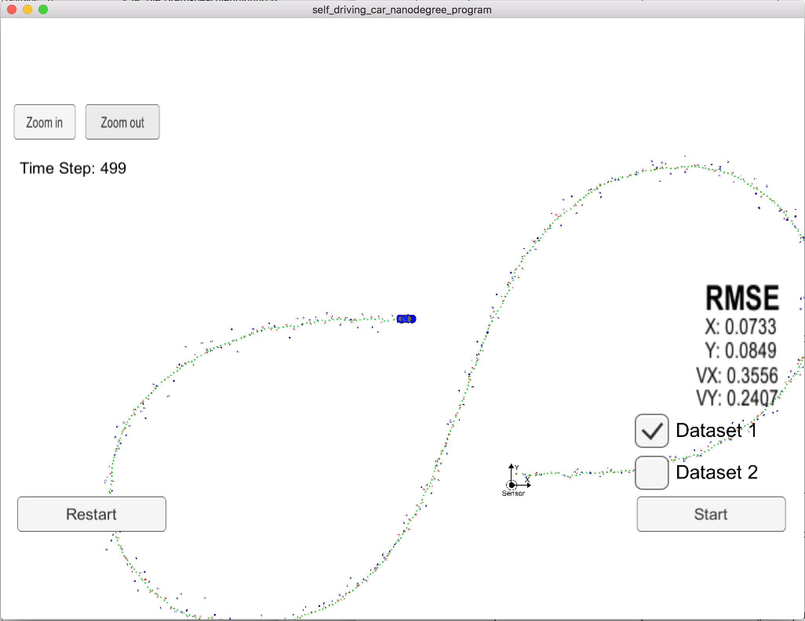
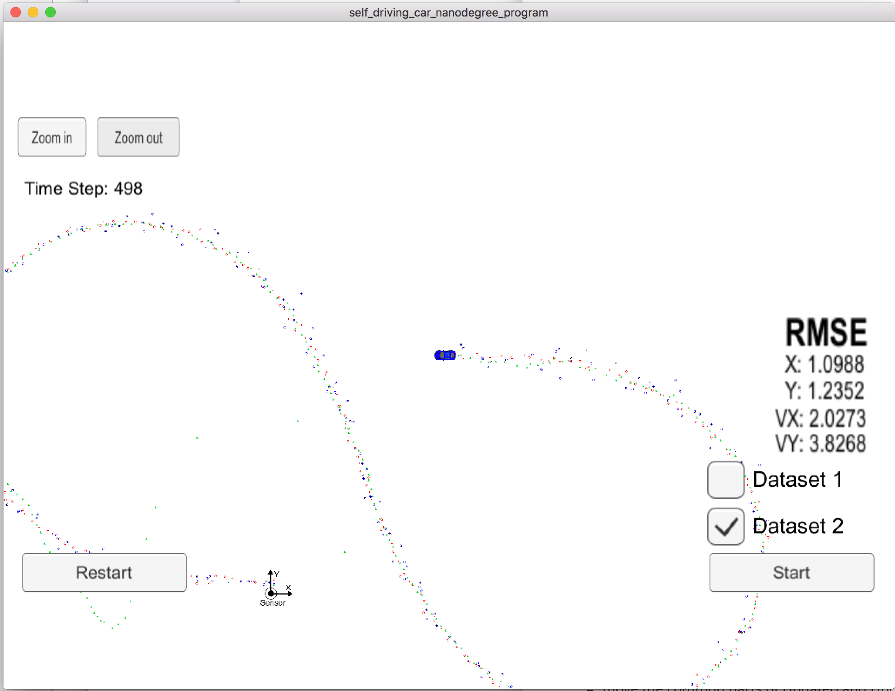

# Unscented Kalman Filter Project Starter Code
Self-Driving Car Engineer Nanodegree Program

## Overview
In this project an Unscented Kalman Filter is utilized to estimate the state of a moving object of interest with noisy lidar and radar measurements.

## Results
The RMSE result of the tracking algorithm meet the challenges of  [.09, .10, .40, .30] as long as both, the radar data and the lidar data are used.  If only one of the sensor data sets are used the results are significantly worse and do not meet the challenge whereby lidar data only leads to better results than radar data. 

the tables below show the RMSE results and the NIS results of lidar data and radar data that were obtained by this implementation.

##### Dataset 1:

|      RMSE | Radar and Lidar data | Lidar data only | Radar data only |
| --------: | :------------------: | :-------------: | :-------------: |
|         x |        0.0733        |     0.1747      |     0.2246      |
|         y |        0.0849        |     0.1507      |     0.3027      |
|        vx |        0.3556        |     0.6363      |     0.5222      |
|        vy |        0.2407        |     0.3028      |     0.3965      |
| NIS_Lidar |        2.81%         |      4.82%      |       n/a       |
| NIS_Radar |        3.61%         |       n/a       |      3.22%      |

##### Dataset 2:

|      RMSE | Radar and Lidar data | Lidar data only | Radar data only |
| --------: | :------------------: | :-------------: | :-------------: |
|         x |        0.0882        |     0.1656      |     1.0988      |
|         y |        0.0758        |     0.1453      |     1.2352      |
|        vx |        0.6679        |     0.6156      |     2.0273      |
|        vy |        0.3269        |     0.3321      |     3.8268      |
| NIS_Lidar |        5.22%         |      3.22%      |       n/a       |
| NIS_Radar |        5.24%         |       n/a       |     14.92%      |

The image below shows the tracking results using radar data and lidar data of dataset 1:

#### Tracking problems with dataset 2 if only radar data is used
The tracking results are very poor if only the radar data of dataset 2 is used. When the tracking starts the object is predicted at totally wrong positions. After some data sets have been processed, the tracking results are much better (refer to the area around button "Restart" in image below).

 

## Comparison of the results of UKF versus the result of EKF
Compared to the EKF  the UKF reached  the same accuracy of the tracking of the object position. The  tracking of the objects velocity is more accurate when using the UKF.

The table below shows the tracking accuracy of UKF and EKF for dataset 1. 

| RMSE |  UKF   |  EKF   |
| ---: | :----: | :----: |
|    x | 0.0733 | 0.0973 |
|    y | 0.0849 | 0.0855 |
|   vx | 0.3556 | 0.4513 |
|   vy | 0.2407 | 0.4399 |

---

## Dependencies
* cmake >= 3.5
  * All OSes: [click here for installation instructions](https://cmake.org/install/)
* make >= 4.1 (Linux, Mac), 3.81 (Windows)
  * Linux: make is installed by default on most Linux distros
  * Mac: [install Xcode command line tools to get make](https://developer.apple.com/xcode/features/)
  * Windows: [Click here for installation instructions](http://gnuwin32.sourceforge.net/packages/make.htm)
* gcc/g++ >= 5.4
  * Linux: gcc / g++ is installed by default on most Linux distros
  * Mac: same deal as make - [install Xcode command line tools](https://developer.apple.com/xcode/features/)
  * Windows: recommend using [MinGW](http://www.mingw.org/)

## Basic Build Instructions

1. Clone this repo.
2. Make a build directory: `mkdir build && cd build`
3. Compile: `cmake .. && make`
4. Run it: `./UnscentedKF` Previous versions use i/o from text files.  The current state uses i/o
  from the simulator.
